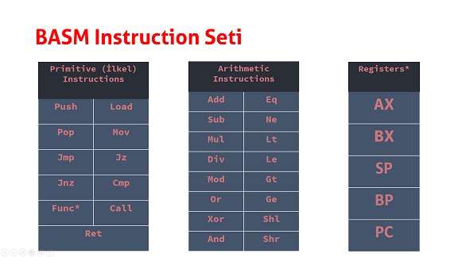

# BengiVM - BASM
[](https://travis-ci.org/humanova/Bengi)

Stack Virtual Machine based programming language project.

[blog post (turkish)](https://humanova.github.io/post/bengi)

[debugging bengi programs using a python script](https://www.youtube.com/watch?v=mkqNtYPKTWQ)

## BASM Fibonacci Example

(Note : On both implementations: iterative algorithm is used to get fibonacci(n).)
### C Implementation

```c
int fibonacci(int n)
{
    int ret = 1;
    int prev = 0;
    int prevprev;
    for (int i = 1; i < n; i++)
    {
        prevprev = prev;
        prev = ret;
        ret = prev + prevprev;
    }
    return ret;
}

int main()
{
    int fib = fibonacci(20)
    return fib;
}
```

### BASM Implementation

```assembly
//; fibonacci(n) function, bengi-asm

.fib:
    mov bx [-1]     //; copy func. argument to BX
                    //; as loop stop variable

    push 2          //; loop var
    mov ax 1
    push 1
                    //; loop start
    push ax
    add
    push [sp]
    push ax
    sub
    mov ax [sp]
    pop
                    //; loop var += 1
    push [1]
    push 1
    add
                    //; copy loop var
    mov [1] [sp]
                    //; check if loop var == loop stop var
    push bx
    eq
    jz 12           //; jump to loop start instruction (push ax)
                    //; and pop stack
                    //; loop end

    mov ax [sp]     //; write return value to AX
    pop             //; remove function locals
    pop
    ret             //; return

.main:
    push 20         //; push 20 as function argument
    call fib        //; call fibonacci function
    pop             //; remove function argument
    push ax         //; push function return value
    end             //; end program
```

## Usage

Use `bengi -c fib.basm` or `basm fib.basm` to compile `fib.basm` file.

```
$ bengi -c fib.basm
$ ls
fib.basm fib.cben
```

After compiling `fib.basm` into `fib.cben`(bytecode file), now use `bengi fib.cben` to run bytecode file in VM.

```
$ bengi fib.cben
tos : 6765  SP : 1
```

VM returns `6765` which is 20th number of fibonacci.

## Compiling

```
mkdir build
cmake .. -DCMAKE_CXX_COMPILER=<your_cpp_compiler>
cmake --build .
```

## BASM Instruction Format

```text
32 bit instructions
first 3 bits : header
next 29 bits : data

Header format :
100 : Primitive Instruction
011 : Addressing ([10] etc.)
010 : Negative Addressing ([-10] etc.)
110 : Register
111 : Symbol
000 : Positive Integer
001 : Negative Integer

reg   reg data    regaddr data
AX    0001        00f1
BX    0002        00f2
SP    0003        00f3
BP    0004        00f4
PC    0005
```

## BASM Instruction Set

11 primitive, 16 arithmetic instructions.

5 VM Registers.



## Registers

---

|ID  | Register     | Purpose                                 | 
|:---|:-------------|:----------------------------------------|
| 1  | AX           | Accumulator register                    |
| 2  | BX           | Accumulator register                    |  
| 3  | SP           | Points to top of the stack              |
| 4  | BP           | Points to current function's stack frame|
| 5  | PC           | Points to current instruction           |

## Calling Convention

Bengi calling convention works similar to _`__stdcall`_. Caller's function arguments be pushed onto the stack before the function call. Calee has to push arguments to its own stack frame and has to remove them before `return`. 

Pseudocode:

```assembly
caller :
    push arg        //;  push function arguments
    call func       //; (push PC, push BP, PC = func address, BP = new BP)
    pop arg         //; delete function arguments

callee :
    push[-1]        //; get last pushed value (argument)
    mov ax [sp]     //; store return value on AX
    pop             //; remove locals(if there's any)
    ret             //; return (BP = old BP, pop, PC = old PC, pop)
```
