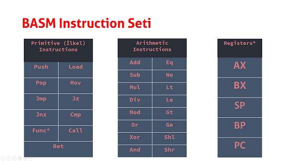

# BengiVM - BengiASM Project

Stack Virtual Machine based programming language project.

## Example program


Use `bengi -c ornek.basm` or `basm ornek.basm` to compile this `ornek.basm`. Bengi Assembler finds function declerations and symbolizes them. So that we can call our declared functions.

```
$ bengi -c ornek.basm
symbolizing function : fonk (symbol : e0000010)
symbolizing function : main (symbol : e0000000)
```

After compiling `ornek.cben`, now use `bengi ornek.cben` to run compiled file on VM.

```
$ bengi ornek.cben
tos : 4  SP : 3
```

BengiVM loads the program, runs it and returns `4`.

## BASM Instruction Set

BASM Instruction Set:
11 primitive, 16 arithmetic instructions.
5 VM Registers.




## BASM Instruction Format
```text

32 bit instructions
first 3 bits : header
next 29 bits : data
Header format :

100 : Primitive Instruction
011 : Addressing ([10] etc.)
010 : Negative Addressing ([-10] etc.)
110 : Register
111 : Symbol
000 : Positive Integer
001 : Negative Integer

register	data
AX			0001
BX			0002
SP			0003
BP			0004
PC			0005
```

## Registers
---

| Register     | İşlev                                    |ID  |
|:-------------|:----------------------------------------:|:---|
| AX           | Stores any value                         | 1  |
| BX           | Stores any value                         | 2  |
| SP           | Points top of the stack                  | 3  |
| BP           | Points current function's stack frame    | 4  |
| PC           | Points next instruction to run           | 5  |


## Bengi Calling Convention
Bengi Calling Convention, is complete rule of calling any function. Bengi Calling Convention works similar to _`__stdcall`_. Every function argument is pushed on the stack.

Calling Convention Pseudocode:
```assembly
caller :
    push arg	//	push function arguments
    call func	//	(push PC, push BP, PC = func address, BP = new BP)
    pop arg	//	delete function arguments

callee :
    push[-1]		//	get last pushed value (argument)
    mov ax [sp] 	//	store return value on AX
    pop			//	remove locals(if there's any)
    ret			//	return (BP = old BP, pop, PC = old PC, pop)
```


## BASM Fibonacci Example

(Note : On both implementations: i used iterative way to find fibonacci(n).)
### C Implementation

```c
int fibonacci(int n)
{
    int ret = 1;
    int prev = 0;
    int prevprev;
    for (int i = 1; i < n; i++)
    {
        prevprev = prev;
        prev = ret;
        ret = prev + prevprev;
    }
	return ret;
}

int main()
{
    int fib = fibonacci(20)
    return fib;
}
```

### BASM Implementation

```assembly
//; fibonacci(n) function, bengi-asm

.fib:
    mov bx [-1]   	//; copy func. argument to BX
			//; as loop stop variable

    push 2        	//; loop var
    mov ax 1
    push 1
                  	//; loop start
    push ax
    add
    push [sp]
    push ax
    sub 
    mov ax [sp]
    pop
                  	//; loop var += 1
    push [1]
    push 1
    add
                	//; copy loop var
    mov [1] [sp]
                	//; check if loop var == loop stop var
    push bx      
    eq
    jz 1012     	//; jump to loop start instruction (push ax)
                	//; and pop stack
                	//; loop end

    mov ax [sp]		//; write return value to AX
    pop			//; remove function locals
    pop
    ret			//; return 

.main:
    push 20		//; push 20 as function argument
    call fib 		//; call fibonacci function
    pop			//; remove function argument
    push ax		//; push function return value
    end			//; end program
```