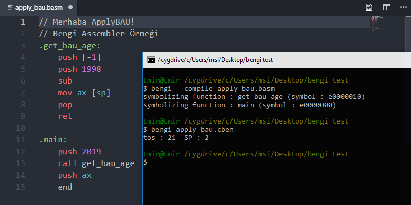
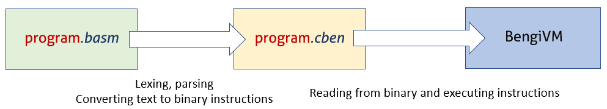
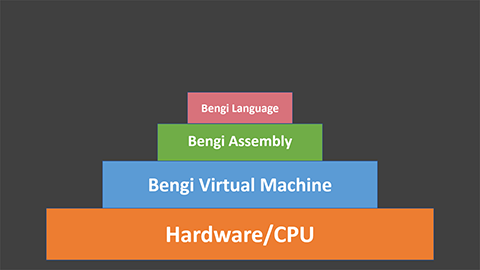
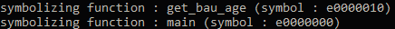
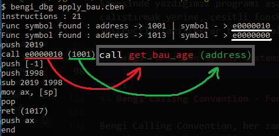
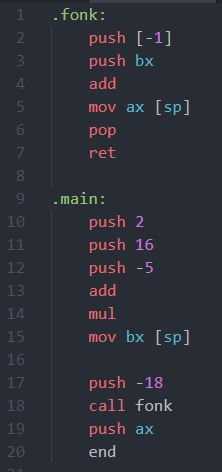

# BengiVM - BengiASM Project

Emir Erbasan 2019

blog post : https://humanova.github.io/humanova/post/bengi



### İçerik:
*	[Nasıl Başladım?](#nasıl-başladım)
*	[Ne yaptım?](#ne-yaptım)
*	[Ne yapacağım?](#ne-yapacağım)
*	[BASM Instruction Seti](#bams-instruction-seti)
*	[BASM Instruction Formatı](#basm-instruction-formatı)
*	[Registerlar](#registerlar)
*	[Bengi Fonksiyon-Symbol Sistemi](#bengi-fonksiyon-symbol-sistemi)
*	[Bengi Calling Convention - Fonksiyon Çağırma Düzeni](#bengi-calling-convention---fonksiyon-çağırma-düzeni)
*	[Örnek Program](#örnek-program)
*	[BASM Fibonacci Örneği](#basm-fibonacci-örneği)

### [Bengi GitHub Repo](https://github.com/humanova/Bengi) | https://github.com/humanova/Bengi

## Nasıl başladım?
---
Son birkaç yıldır _**low level programming**_ ve _**reverse engineering**_ gibi konularla ilgilenmemin ardından, programlama dillerine ve **derleyici teorisi**ne olan merağım da artmaya başladı. Uzun zamandır kafama takılan bu konuyu, **Kasım-Aralık 2018** gibi araştırmaya başladım. Dil dediğimiz şey nedir, nasıl çalışır, yazdığımız kodu işlemci nasıl yorumlar gibi soruların cevaplarını öğrenebilmek adına derleyici teorisini öğrenmeye başladım. Ardından *-az bilmemin getirdiği özgüven ile-* kendi dilimi yazmaya karar verdim.

 Kendi dilimi yazmaya karar verdiğim sırada aslında bu konu üzerindeki bilgim epey azdı. Bu zamanlar kafamdaki şey; **makine koduna derlenen fonksiyonel bir dil** yazmak, bu dili **_Python_** gibi yorumlanan ve görece yavaş çalışan bir dilde performans gerektiren işlerde kullanmaktı. Ancak bunu yapabilmem için gerekli olan bilgim ve deneyimim hiç yoktu.
(Kafamdaki bu dilin çok uğraştırıcı ve zaman alıcı bir şey olduğunu şuan da belirtmek istiyorum. _**Intel**_'in kendi `x64` ve `x86` mimarisini anlattığı  kılavuzun 5000 sayfaya yakın olduğunu göz önünde bulundurursak, aklımdaki dilin **syntax**'ini oluşturup düzgün bir şekilde parse edebilsem bile işlemci instructionlarına dönüştürmem epey zamanımı alırdı)

Bu nedenle daha kolay konseptler üzerinde kendimi geliştirip sonrasında bu hayalimi gerçekleştirmeye karar verdim. Aklıma gelen basit konseptler arasından (_**interpreted** ya da **bytecode**'a derlenen bir VM dili_) bir **sanal makine**(VM) dili oluşturmayı seçtim. 

VM konseptini seçmemin önemli bir nedeni de, bir nevi **kendi işlemcimi**, kendi kodumla **simüle edebilme** imkanına sahip olmam. Sadece bir mimari öğrenip ona kod derlemek yerine **mimariyi kendim üretip** onun üzerinde çalışacak instructionları da benim derleyebilmem bana hem öğrenme hem de uygulama anlamında daha çok imkan sundu. Yaratıcı çözümler üretebilme anlamında da bu durumun çok büyük etkisi oldu. 

VM dil konseptlerini öğrenmeye başladım. Çeşitli videolar ve benzer projelerden öğrenip uygulamayı çalıştım. (Yine bir VM dili olan Java dilinin de derlenme/çalışma prensiplerini de kabaca öğrendim.)

Ve ortaya **BASM** ve **BengiVM** çıktı.

## Ne yaptım?
---
**C++** ile, bir _Stack VM_ ve bu _VM_ üzerinde çalışacak instructionları derleyen bir **Assembler** yazdım. 

**Bengi Assembler**: _`.basm`_ uzantılı ve içerisinde kendi Assembly'sinin olduğu metin dosyalarını okuyor ve her biri 32 bit olan instructionlara dönüşütürüyor. Ardından _`.cben`_ uzantılı bir binary dosyasına, bu 32 bit instructionları sırayla yazıyor. Bytecode'umuzu üreten program diyebiliriz.

**Bengi Assembly(BASM)**: Assembler'ın okuduğu metin dosyasındaki sanal makine Assembly'miz. `X86 Assembly` instructionlarına benzer instruction setine sahip. Ve temel(primitive) instruction'ların neredeyse hepsini içeriyor.

**Bengi Virtual Machine(BengiVM)**: Assembler tarafından derlenmiş _`.cben`_ uzantılı dosyadan intructionları okur ve çalıştırır. VM instructionları sırayla okur ancak sırayla çalıştırmaz. Önce _`main`_ sembolünün adresini bulur ve instructionları çalıştırmaya bu adresden başlar. 

**BengiDLL**: Bengi Virtual Machine fonksiyonlarını çağırabilen basit bir _**dynamic library**_. Bu library'yi kullanarak _`.cben`_ dosyalarını sanal makinede çalıştırıp sonuçlarını döndürmek mümkün. _Python_ _`ctypes`_ modülü ile `bengi.dll`'i import edip, Bengi Unit Testlerin hepsini tek bir python scripti ile çalıştırabiliyorum.  


Yani toparlayacak olursak: Bengi Assembly yazılan kodları Assembler ile bytecode'a dönüştürüyoruz. Bu bytecode dosyasını(`.cben`) sanal makine okuyor ve çalıştırıyor.

## Ne yapacağım?
---

Bengi Virtual Machine ve Bengi Assembly'yi geliştirmeye devam edip, aynı zamanda bu iki yapıtaşı üzerine kurulu bir **high level programlama dili** geliştirmek istiyorum. Bunun için biraz daha yolum var. Oluşturmak istediğim Bengi dilini kendimin de aktif bir şekilde kullandığı bir dil olmasını istiyorum. Bu nedenle sağlam temeller üzerinde bu dili oluşturmanın çok daha sağlıklı olacağını düşünüyorum. Şuanlık amacım BengiASM'i **üzerine konulabilir** şekilde, daha da geliştirmek.   



## BASM Instruction Seti
---

BASM Instruction Seti; 11 ilkel, 16 aritmetik instructiondan oluşuyor.
Ayrıca 5 adet temel VM Registerı var.


## BASM Instruction Formatı
---
Her instruction 32 bitten oluşur ve ilk 3 bit **instruction tipini**, sonraki 29 bit ise bu **instruction data**'yı oluşturur. 

İlk zamanlar 2 bit header - 30 bit data formatını kullanmaya karar vermiştim. Sonrasında yeni tipler eklemem gerekti ve 3 - 29 formatına geçtim. 29 bitlik bir data olmasından memnun değilim ancak yeni tipleri eklemek için bunu uygulamalıydım. 

İleride _bitfield_'lar ve değişken boyutta instructionlar kullanarak daha iyi bir instruction formatı geliştirmeyi düşünüyorum.

```text
Header format :

100 : Primitive Instruction
011 : Addressing ([10] etc.)
010 : Negative Addressing ([-10] etc.)
110 : Register
111 : Symbol
000 : Positive Integer
001 : Negative Integer

register	data
AX			0001
BX			0002
SP			0003
BP			0004
PC			0005
```

Instruction headerlara bakarken farketmiş olabileceğiniz gibi: _`float`_ gibi temel veri tipleri henüz BASM ve BengiVM'de yok. Zor olanı sonraya bırakıyorum diyebilirim. Fonksiyon-symbol sistemini(fonk. çağırma, döndürme, argüman iletme) de bu blogu hazırlamadan hemen öncesindeki günlerde ekledim.


## Registerlar
---
`AX`, `BX`, `BP`, `SP`, `PC` olmak üzere 5 adet sanal makine registerı var. Her register 32 bitten oluşuyor ve 4 farklı işlevi olan register var.


|ID  | Register     | İşlev                                     | 
|:---|:-------------|:------------------------------------------|
| 1  | AX           | Veri tutmak, taşımak                      |
| 2  | BX           | Veri tutmak, taşımak                      |  
| 3  | SP           | Son stack elemanını işaret etmek          |
| 4  | BP           | Fonksiyon stack frame'i işaret etmek      |
| 5  | PC           | Çalıştırılacak instructionı işaret etmek  |

### **AX ve BX**:

Bu iki registerımız basit veriler tutuyor. Teoride **Akümülatör Register**ı olarak geçiyorlar. Bu VM için görevleri; çağırılan fonksiyonlardan dönen değerleri tutmak, aritmetik işlemlerinden ardından (isteğe bağlı olarak) stackteki herhangi bir veriyi tutmak.

### **SP**: 
**Stack Pointer**, Stack'teki son değerin(en tepedeki) adresini gösterir. Stack Pointer sayesinde program akışı sırasında Stacki kontrol ederiz.

### **BP**: 
Base Pointer ya da Base Register şeklinde adlandırılabilir. Yaptığı şey: Bir fonksiyon çağırıldığında, stack üzerinde çağırdığımız fonksiyonu **baz adres** olarak tutar. Bir fonksiyon içindeyken adresleme işlemlerinde base pointer sayesinde **relative** olarak adresleme yapılabilir. Böylece fonksiyon yazarken programın genelini düşünerek adresleme yapmanın zorluğundan kurtuluruz.

### **PC**: 
Program Counter ya da Program Pointer şeklinde adlandırılabilir. Yaptığı şey, VM'in o sırada uygulayacağı intructionı işaret etmektir. Program Counter sayesinde yazdığımız programı aşağıdan yukarıya düz bir şekide işleyip çalıştırmak yerine, çeşitli fonskiyonları çağırıp dilediğimiz adresteki instructionları tekrar tekrar çalıştırabiliyoruz.


## Bengi Fonksiyon-Symbol Sistemi
---
Not: BASM'deki fonksiyon tanımlama yazımı(`.fonk:`), gerçek Assembly dillerinde sectionları tanımlamak için kullanılan bir yazım. Bunun farkındayım. Bu yazımı kullanmak `.basm` dosyalarında derleme sırasında fonksiyon tanımlarının bulunmasında kolaylık sağlıyor.(Çünkü iki özel karakter arasına fonksiyon ismi yazılıyor ve bunu dosyayı parse ederken ayrıştırması çok kolay.)



BASM'de fonksiyonlar **.**`fonksiyon-adi`**:** şeklinde tanımlanır ve program derlenirken her fonksiyona özel bir sembol üretilir. Her yeni tanımlanan sembol, sembol tablosu denen vektöre ismi ile birlikte(fonksiyon ismi) itilir ve kaydedilir. 

Sembol tablosunun ilk elemanı her zaman _`main`_ fonksiyonudur ve sembolü daima _`0xE0000000`_'dir. Her program _`main`_ fonksiyonu barındırmak zorundadır. Assembler _main_ tanımlaması göremezse derleme işlemini bitirir.

Eğer bu tanımlanmış fonksiyonlardan biri dosyada tekrar tanımlanırsa BASM hata verir ve program derlenemez. 

Önceden tanımlanmış bir fonksiyon tekrar tanımlanmadan, ismi dosyada kullanılırsa("_`call fonksiyon`_" gibi), isminin geçtiği adrese sembol değeri yazılır.(Bu şekilde binary'ye derlenir.)

Fonksiyon tanımlamalarının yapıldığı yerler "_`func`_ `symbol`" instruction formatında binary'ye çevirilir. (_`func`_ kullanıcının değil, assembler'ın kullanabildiği özel bir instructiondır. "`.basm` dosyası" üzerindeki sembolleri işaretlemek için kullanılır)



Bengi Virtual Machine binary dosyasını okurken ilk yaptığı şey tüm dosya üzerinde **sembol** aramaktır. Bunu yaparken _`func`_ instructionlarını bulur ve bulduğu her _`func`_ instructionının ardından gelen instructionı **sembol tablosuna**, sembolün adresi ile birlikte kaydeder. 

Her program _`main`_ fonksiyonundan başlar.

Program çalıştırılmaya başladıktan sonra bu sembolün tekrar kullanıldığı(örn. fonksiyon çağırma) görürülürse, **sembol** hakkında tabloya kaydettiği bilgileri kullanarak işlem yapar.


## Bengi Calling Convention - Fonksiyon Çağırma Düzeni
---
Bengi Calling Convention, her zaman uyulması gereken fonksiyon çağırma kuralları bütünü denebilir. Bengi Calling Convention _`__stdcall`_ gibi tamamen stack üzerinden işliyor.

Çağırma düzeni pseudocode üzerinde şöyle:
```assembly
caller :
    push arg	//	fonkiyon argümanlarını ittir
    call func	//	(push PC, push BP, PC = fonksiyon adresi, BP = yeni BP)
    pop arg	//	fonksiyon argümanlarını stackten sil

callee :
    push[-1]		//	son ittirilen elemanı al (argüman)
    mov ax [sp] 	//	AX'e dönme değerini yaz
    pop			//	lokalleri stackten sil
    ret			//	return (BP = eski BP, pop, PC = eski PC, pop)
```

### **Fonksiyonu çağıran**: 
Çağıracağı fonksiyon herhangi bir argüman gerektiriyorsa, fonksiyon çağırılmadan önce argümanları stacke ittirmekten sorumlu. Argümanlar ittirildikten sonra _`call`_ ile fonksiyonu çağırır. Eğer gerekliyse, fonksiyon argümanlarını stackten silmek de kendi görevidir.

**`Call`** aslında birden fazla instruction içeren bir instruction. Sırasıyla yaptığı şeyler: 

1 - `PC`'yi stacke ittir. (Fonksiyonun çağırıldığı yere dönebilmesi için gerekli)

2 - `BP`'yi stacke ittir. (Fonk. döndükten sonra çağırılmadan önceki `BP` değerini tekrar alabilmesi için gerekli)

3 - `PC`'yi fonksiyon adresine eşitle. (Fonksiyondaki instructionlari çalıştırabilmek için önce fonksiyon adresine zıplamamız(`jmp`) gerekli)

4 - `BP`'yi yeni `BP`'ye eşitle. (Önceki fonksiyon ile çalıştırılan fonksiyonun stack frameleri arasında bir ayrıt gerekli ki, genel adreslemeden bağımsız olarak bir adresleme kullanabilelim ve her fonksiyon kendi lokalindekilerle çalışsın. `BP`'yi değiştirmemizin gerekçesi bu.)

### **Çağırılan fonksiyon**: 
Çalışması için herhangi bir argüman gerekli ise bu argümanları stack üzerinden seçerek, kendi stack frameine ittirmekle sorumlu. Döndürmesi gereken bir değer var ise `AX` ya da `BX` registerlarına bu değerleri -**zorunlu olarak**- yazarak döndürmeli. Dönme değerini hazırladıktan sonra _`ret`_ ile dönmeden önce stack frameinde bulunan lokalleri silmek -**zorunlu olarak**- kendi görevidir. 

(**Herhangi bir fonksiyonun başarılı bir şekilde dönebilmesi için SP'nin eski BP'nin adresini göstermesi zorunludur.** Tüm lokaller silindikten sonra SP'nin gösterdiği değer eski BP'yi kaydettiğimiz adrestir. BengiVM bu bilgiye güvenerek fonksiyonu döndürür.)

**`Ret`** birden fazla instruction içeren bir instruction. Sırasıyla yaptığı şeyler:

1 - `BP`'yi eski `BP`'ye eşitle. (_`ret`_'in ardından `SP`'nin gösterdiği adresteki değer, `BP`'nin önceki değeridir (bu değer fonksiyon çağırılırken _`call`_ ile ittirilmişti). Önceki `BP` değerine dönerek çağıran fonksiyonun bulunduğu stack frame'e yeniden girmiş oluyoruz.)

2 - `pop`. (Eski `BP`'yi tutan stack elemanıyla işimiz bittiği için siliyoruz.)

3 - `PC`'yi eski `PC`'ye eşitle. (Fonksiyon çağırırken _call_ instructionu ile ittirdiğimiz eski Program Counter'ımızı yeniden kullanmaya başlıyoruz. Yani fonksiyonu çağırdığımız yere geri zıplıyoruz)

4 - `pop`. (Eski `BP`'yi tutan stack elemanıyla işimiz bittiği için siliyoruz.)

## Örnek program
---


Bu programı `bengi -c ornek.basm` ya da `basm ornek.basm` komutlarıyla derliyoruz. Derlenirken, Bengi Assembler dosyadaki fonksiyonları bulup her fonksiyonu sembolize ediyor. Bu sayede fonksiyon tanımlayıp çağırabiliyoruz.

```
$ bengi -c ornek.basm
symbolizing function : fonk (symbol : e0000010)
symbolizing function : main (symbol : e0000000)
```

Derlemenin ardından üretilmiş `ornek.cben` dosyasını, `bengi ornek.cben` komutu ile VM üzerinde çalıştırıyoruz.

```
$ bengi ornek.cben
tos : 4  SP : 3
```

BengiVM programı yüklüyor, çalıştırıyor ve 4 sonucunu veriyor. Şimdi bu sonucun nasıl üretildiğine sırayla instructionlar üzerinden giderek bakalım.

İlk olarak; _`main`_ fonksiyonumuzda, stack'e 3 adet tam sayı ittirip bunlar arasında işlem yapıyoruz. (`16 + (-5)` ardından `11 * 2`)

```assembly
.main:
	push 2 
	push 16
	push -5
	add		//; 16 + (-5) 	--> 11
	mul		//; 11 * 2	--> 22
```
İşlemlerin ardından stackte kalan sonucu _`mov`_ ile `BX register`ımıza aktarıyoruz.

```assembly
	mov bx [sp]
```

Sonrasında çağırılacak fonksiyonumuz için argümanımızı stacke ittirip, fonskiyonu _`call`_ ile çağırıyoruz. 

```assembly
	push -18
	call fonk
```

Bu fonksiyonun ilk yaptığı şey, **stacke en son ittirilmiş değeri** kendi stack frame'ine tekrar ittirmek. (`push[-1]`) Yani kendisi çağırılmadan önce ittirdiğimiz argümanı kullanabilmek için bu argümanı stackteki kendi bölmesine  tekrar ittirdi.

```assembly
.fonk:
	push [-1]
```

Ardından `BX register`da tutulan değeri de ittirip, fonksiyon argümanıyla topluyor.

```assembly
	push bx
	add
```

Bu işlemin sonucunu _`AX registera`_ yazıyor ve stack frame'inde olan her lokali(1 tane var, o da toplam sonucu) _`pop`_ ile stackten siliyor.

```assembly
	mov ax [sp]
	pop
```

Ardından _`ret`_ ile fonksiyon çağırıldığı yere dönüyor.

```assembly
	ret
```

`AX`'te tutulan değer ittiriliyor. Fonksiyonun döndürdüğü sonucu bu şekilde elde ediyoruz.
Ve programımız _end_ ile bitiriliyor.

```assembly
	push ax
	end
```

Program sonunda _`tos : 4  SP : 3`_ şeklinde bir çıktıyla karşılaşıyoruz.

`tos`: Top of the stack demek. Program bitirildiği sırada stackteki son elemanın değerini bize gösteriyor. 

`SP` ise son elemanın stackteki konumunu gösteriyor.

## BASM Fibonacci Örneği
---
Uygulaması görece daha zor olan bir örnek oluşturmak istedim. Aklıma gelen ilk şey, _fibonacci_'nin n. elemanını döndüren bir fonksiyon oluşturmak oldu. 
Bu fonksiyonun hem C hem de BASM implementasyonlarını aşağıda inceleyebilirsiniz.

(Not : İki örnek de iterative şekilde _fibonacci_'yi hesaplıyor.)
### C Implementasyonu

```c
int fibonacci(int n)
{
    int ret = 1;
    int prev = 0;
    int prevprev;
    for (int i = 1; i < n; i++)
    {
        prevprev = prev;
        prev = ret;
        ret = prev + prevprev;
    }
	return ret;
}

int main()
{
    int fib = fibonacci(20)
    return fib;
}
```

### BASM Implementasyonu

```assembly
//; fibonacci(n) function, bengi-asm

.fib:
    mov bx [-1]   	//; copy func. argument to BX
			//; as loop stop variable

    push 2        	//; loop var
    mov ax 1
    push 1
                  	//; loop start
    push ax
    add
    push [sp]
    push ax
    sub 
    mov ax [sp]
    pop
                  	//; loop var += 1
    push [1]
    push 1
    add
                	//; copy loop var
    mov [1] [sp]
                	//; check if loop var == loop stop var
    push bx      
    eq
    jz 1012     	//; jump to loop start instruction (push ax)
                	//; and pop stack
                	//; loop end

    mov ax [sp]		//; write return value to AX
    pop			//; remove function locals
    pop
    ret			//; return 

.main:
    push 20		//; push 20 as function argument
    call fib 		//; call fibonacci function
    pop			//; remove function argument
    push ax		//; push function return value
    end			//; end program
```


